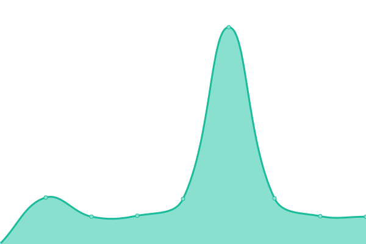
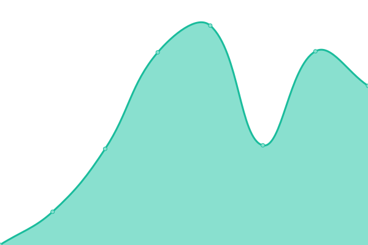
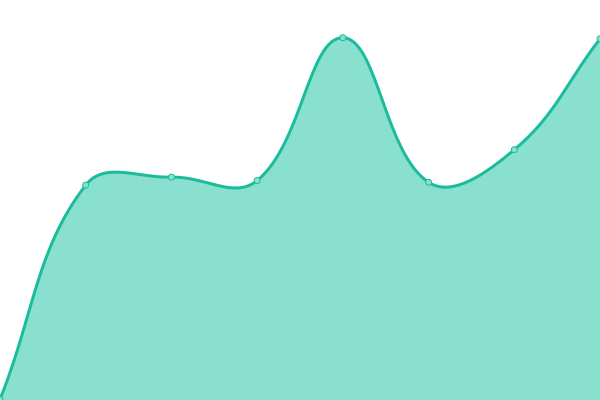

# [📈 Live Status](https://upptime.github.io/upptime): <!--live status--> **🟧 Partial outage**

This repository contains the open-source uptime monitor and status page for [Upptime](https://upptime.js.org), powered by [Upptime](https://github.com/upptime/upptime).

With [Upptime](https://upptime.js.org), you can get your own unlimited and free uptime monitor and status page, powered entirely by a GitHub repository. We use [Issues](https://github.com/upptime/upptime/issues) as incident reports, [Actions](https://github.com/nolog-it/mastodon-uptime/actions) as uptime monitors, and [Pages](https://upptime.github.io/upptime) for the status page.

<!--start: status pages-->
<!-- This summary is generated by Upptime (https://github.com/upptime/upptime) -->
<!-- Do not edit this manually, your changes will be overwritten -->
<!-- prettier-ignore -->
| URL | Status | History | Response Time | Uptime |
| --- | ------ | ------- | ------------- | ------ |
|  [witter.cz](https://witter.cz/nodeinfo/2.0) | 🟩 Up | [witter-cz.yml](https://github.com/nolog-it/mastodon-uptime/commits/HEAD/history/witter-cz.yml) | 

 806ms
     
 | 

<a href="https://nolog-it.github.io/mastodon-uptime/history/witter-cz">100.00%</a>
    

|  [cztwitter.cz](https://cztwitter.cz/nodeinfo/2.0) | 🟩 Up | [cztwitter-cz.yml](https://github.com/nolog-it/mastodon-uptime/commits/HEAD/history/cztwitter-cz.yml) | 

 1100ms
     
 | 

<a href="https://nolog-it.github.io/mastodon-uptime/history/cztwitter-cz">100.00%</a>
    

|  [mastodonczech.cz](https://mastodonczech.cz/nodeinfo/2.0) | 🟩 Up | [mastodonczech-cz.yml](https://github.com/nolog-it/mastodon-uptime/commits/HEAD/history/mastodonczech-cz.yml) | 

 772ms
     
 | 

<a href="https://nolog-it.github.io/mastodon-uptime/history/mastodonczech-cz">100.00%</a>
    

|  [f.cz](https://f.cz/nodeinfo/2.0) | 🟩 Up | [f-cz.yml](https://github.com/nolog-it/mastodon-uptime/commits/HEAD/history/f-cz.yml) | 

 1222ms
     
 | 

<a href="https://nolog-it.github.io/mastodon-uptime/history/f-cz">100.00%</a>
    

|  [mastodon.arch-linux.cz](https://mastodon.arch-linux.cz/nodeinfo/2.0) | 🟩 Up | [mastodon-arch-linux-cz.yml](https://github.com/nolog-it/mastodon-uptime/commits/HEAD/history/mastodon-arch-linux-cz.yml) | 

 667ms
     
 | 

<a href="https://nolog-it.github.io/mastodon-uptime/history/mastodon-arch-linux-cz">100.00%</a>
    

|  [lgbtcz.social](https://lgbtcz.social/nodeinfo/2.0) | 🟩 Up | [lgbtcz-social.yml](https://github.com/nolog-it/mastodon-uptime/commits/HEAD/history/lgbtcz-social.yml) | 

 1357ms
     
 | 

<a href="https://nolog-it.github.io/mastodon-uptime/history/lgbtcz-social">100.00%</a>
    

|  [mastodon.1984.cz](https://mastodon.1984.cz/nodeinfo/2.0) | 🟩 Up | [mastodon-1984-cz.yml](https://github.com/nolog-it/mastodon-uptime/commits/HEAD/history/mastodon-1984-cz.yml) | 

 1705ms
     
 | 

<a href="https://nolog-it.github.io/mastodon-uptime/history/mastodon-1984-cz">100.00%</a>
    

|  [fediverse.cz](https://fediverse.cz/nodeinfo/2.0) | 🟩 Up | [fediverse-cz.yml](https://github.com/nolog-it/mastodon-uptime/commits/HEAD/history/fediverse-cz.yml) | 

 1010ms
     
 | 

<a href="https://nolog-it.github.io/mastodon-uptime/history/fediverse-cz">22.50%</a>
    

|  [mastodon.pirati.cz](https://mastodon.pirati.cz/nodeinfo/2.0) | 🟩 Up | [mastodon-pirati-cz.yml](https://github.com/nolog-it/mastodon-uptime/commits/HEAD/history/mastodon-pirati-cz.yml) | 

 676ms
     
 | 

<a href="https://nolog-it.github.io/mastodon-uptime/history/mastodon-pirati-cz">100.00%</a>
    

|  [gomastodon.cz](https://gomastodon.cz/nodeinfo/2.0) | 🟩 Up | [gomastodon-cz.yml](https://github.com/nolog-it/mastodon-uptime/commits/HEAD/history/gomastodon-cz.yml) | 

 1231ms
     
 | 

<a href="https://nolog-it.github.io/mastodon-uptime/history/gomastodon-cz">44.27%</a>
    

|  [toot.whatever.cz](https://toot.whatever.cz/nodeinfo/2.0) | 🟩 Up | [toot-whatever-cz.yml](https://github.com/nolog-it/mastodon-uptime/commits/HEAD/history/toot-whatever-cz.yml) | 

 4356ms
     
 | 

<a href="https://nolog-it.github.io/mastodon-uptime/history/toot-whatever-cz">99.53%</a>
    

|  [praha.social](https://praha.social/nodeinfo/2.0) | 🟥 Down | [praha-social.yml](https://github.com/nolog-it/mastodon-uptime/commits/HEAD/history/praha-social.yml) | 

 792ms
     
 | 

<a href="https://nolog-it.github.io/mastodon-uptime/history/praha-social">22.49%</a>
    

|  [kompost.cz](https://kompost.cz/nodeinfo/2.0) | 🟩 Up | [kompost-cz.yml](https://github.com/nolog-it/mastodon-uptime/commits/HEAD/history/kompost-cz.yml) | 

 2665ms
     
 | 

<a href="https://nolog-it.github.io/mastodon-uptime/history/kompost-cz">99.75%</a>
    

|  [mastodon.macsnet.cz](https://mastodon.macsnet.cz/nodeinfo/2.0) | 🟩 Up | [mastodon-macsnet-cz.yml](https://github.com/nolog-it/mastodon-uptime/commits/HEAD/history/mastodon-macsnet-cz.yml) | 

 1380ms
     
 | 

<a href="https://nolog-it.github.io/mastodon-uptime/history/mastodon-macsnet-cz">100.00%</a>
    

|  [mutant.cz](https://mutant.cz/nodeinfo/2.0) | 🟩 Up | [mutant-cz.yml](https://github.com/nolog-it/mastodon-uptime/commits/HEAD/history/mutant-cz.yml) | 

 629ms
     
 | 

<a href="https://nolog-it.github.io/mastodon-uptime/history/mutant-cz">100.00%</a>
    

|  [pidibi.com](https://pidibi.com/nodeinfo/2.0) | 🟩 Up | [pidibi-com.yml](https://github.com/nolog-it/mastodon-uptime/commits/HEAD/history/pidibi-com.yml) | 

 118ms
     
 | 

<a href="https://nolog-it.github.io/mastodon-uptime/history/pidibi-com">100.00%</a>
    

|  [mastodon.rozhlas.cz](https://mastodon.rozhlas.cz/nodeinfo/2.0) | 🟩 Up | [mastodon-rozhlas-cz.yml](https://github.com/nolog-it/mastodon-uptime/commits/HEAD/history/mastodon-rozhlas-cz.yml) | 

 813ms
     
 | 

<a href="https://nolog-it.github.io/mastodon-uptime/history/mastodon-rozhlas-cz">100.00%</a>
    

<!--end: status pages-->

[**Visit our status website →**](https://upptime.github.io/upptime)

## 📄 License

- Powered by: [Upptime](https://github.com/upptime/upptime)
- Code: [MIT](./LICENSE) © [Upptime](https://upptime.js.org)
- Data in the `./history` directory: [Open Database License](https://opendatacommons.org/licenses/odbl/1-0/)
